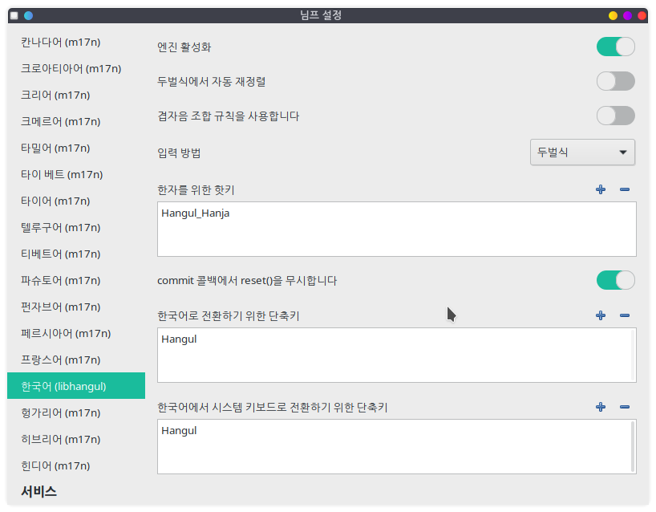

## Nimf
Nimf is a lightweight, fast and extensible input method framework.

Nimf provides:
  * Input Method Server:
    * nimf
  * Language Engines:
    * System keyboard
    * Chinese (based on librime)
    * Japanese (based on anthy)
    * Korean (based on libhangul)
    * Various languages (based on m17n)
  * Service Modules:
    * Indicator (based on appindicator)
    * Wayland
    * NIM (Nimf Input Method)
    * XIM (based on IMdkit)
    * Preedit window
    * Candidate
  * Client Modules:
    * GTK+2, GTK+3, Qt4, Qt5
  * Settings tool to configure the Nimf:
    * nimf-settings
  * Development files:
    * C library, headers and documents

# Project Homepage:
  * https://gitlab.com/nimf-i18n/nimf
  * https://nimf-i18n.gitlab.io

# Installation
    ./autogen.sh

      make
      sudo make install
      sudo ldconfig
      sudo make update-gtk-im-cache
      sudo make update-gtk-icon-cache

    To uninstall nimf, run the following command.

      sudo make uninstall
      
# License

  Nimf is free software: you can redistribute it and/or modify it
  under the terms of the GNU Lesser General Public License as published
  by the Free Software Foundation, either version 3 of the License, or
  (at your option) any later version.

  Nimf is distributed in the hope that it will be useful, but
  WITHOUT ANY WARRANTY; without even the implied warranty of
  MERCHANTABILITY or FITNESS FOR A PARTICULAR PURPOSE.
  See the GNU Lesser General Public License for more details.

  You should have received a copy of the GNU Lesser General Public License
  along with this program;  If not, see <http://www.gnu.org/licenses/>.